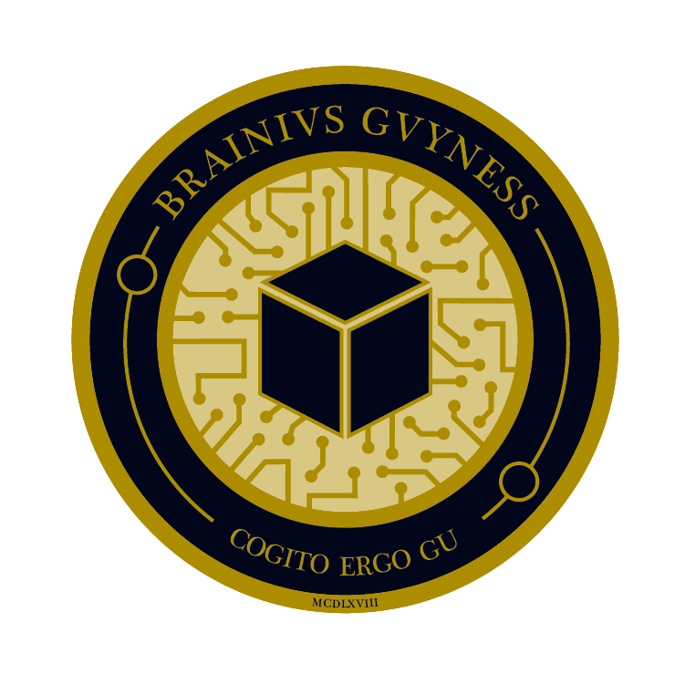
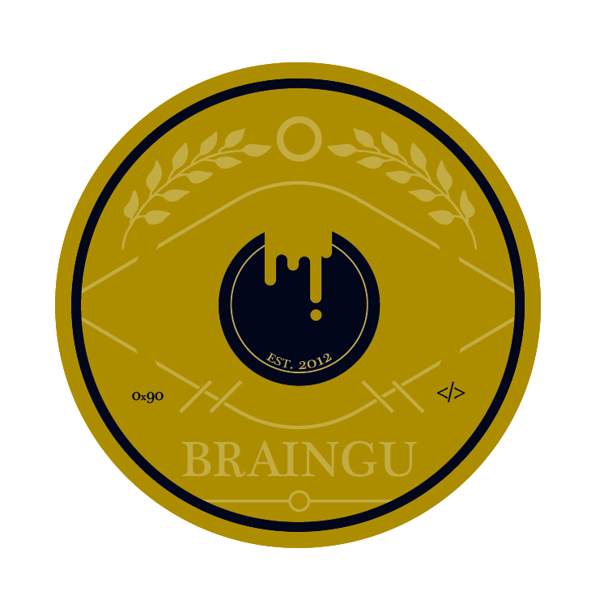

## TLP: GREEN
This document is for distribution within BrainGu, to its industry partners, and to potential job candidates.

## Contents
- [Coin](#Coin)
- [Explaination](#Explaination)
- [Credits](#credits)
- [Changelog](#changelog)

## Coin

## Explaination
This coin was created as a commerative token for the employees who were a part of this achievement.  Only 100 of these coins were created and distributed to active employees in the 2021 Holiday Swag Box.  

###  BRAINIVS GVYNESS
Latin dreamed up by Spence -- <b> BrainGu </b>

### Box
Representation of the BrainGu theme -- <b> Change The Box </b>

### COGITO ERGO GU
Latin dreamed up by Spence -- <b> I think, therefore I Gu </b>

### MCDLXVIII
In 2021, BrainGu made it into the Inc 5000 fastest growing companies in America.  7 million companies applied and we were selected to be ranked as one of the 5000 fastest growing companies in America! Recognition like this isn't possible without every single person at BrainGu being dedicated and working hard on a regular basis! So congrats BrainGu, but mostly congrats Guvians!

BrainGu ranked 1468! https://www.inc.com/profile/braingu

### EST 2012
This is the year BrainGu was founded.  It is important to remember where BrainGu started in order to reflect on the accomplishments to come.

### 0x90
Added as a piece of character, Brent suggested we include his favorite OpCode, 0x90. https://en.wikipedia.org/wiki/NOP_(code)

### </>
HTML Tag to end a segement in a page.  

## Credits
Design - Lyla LaMay

## Changelog

*  Created by Brent Johnson
*  Last modified by Brent Johnson on Jan 14, 2022
