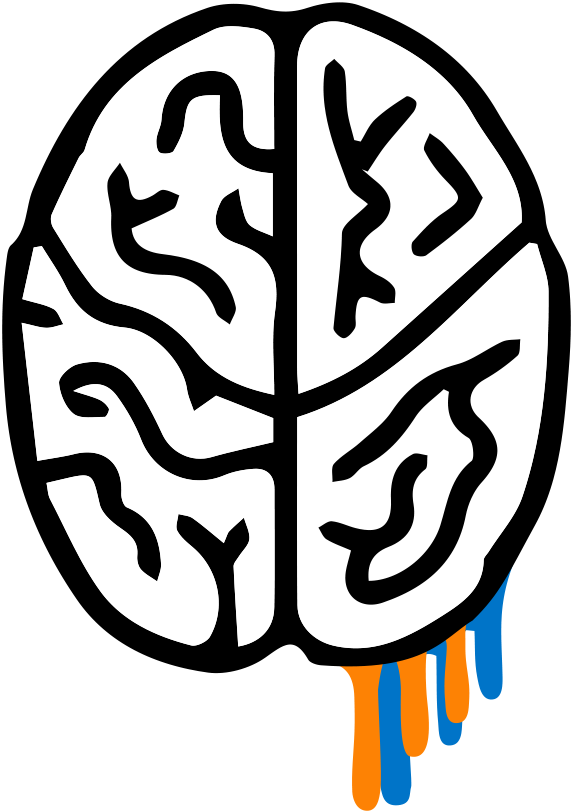
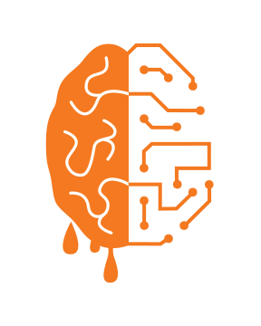
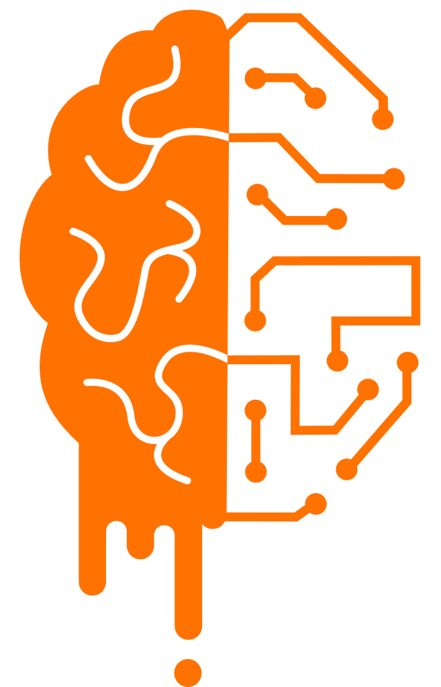
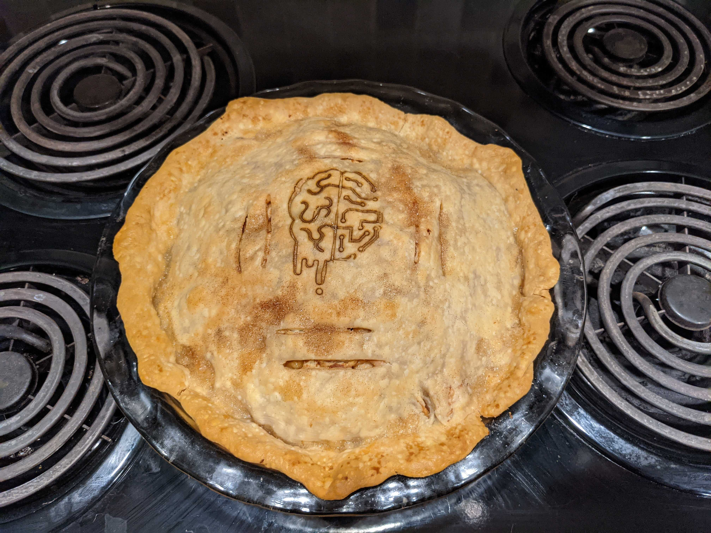
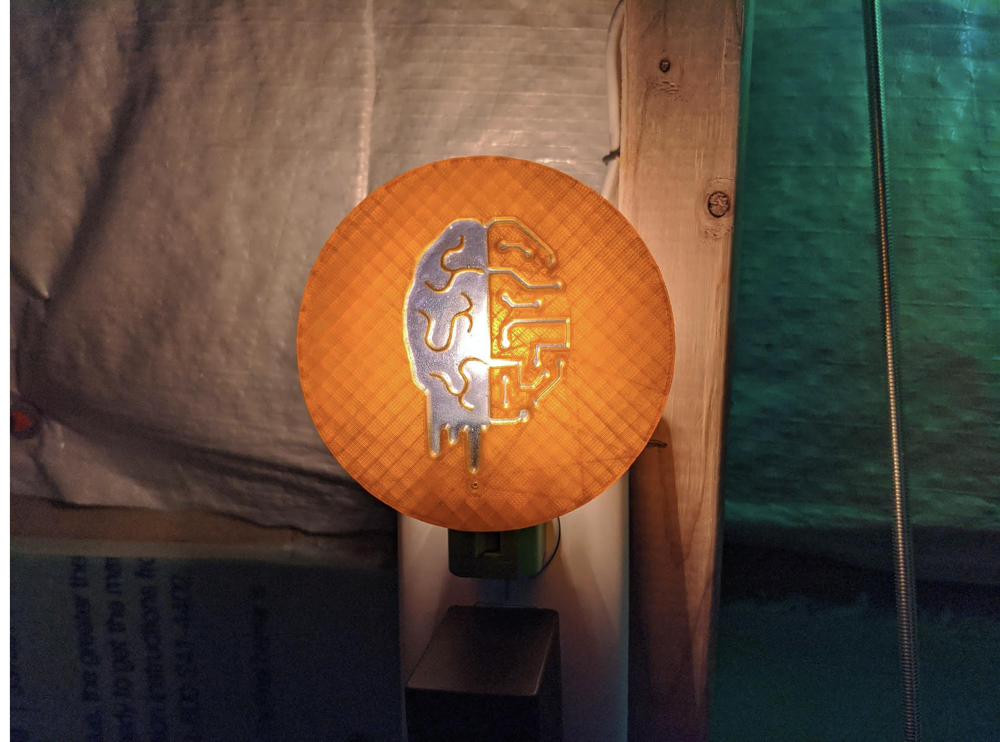
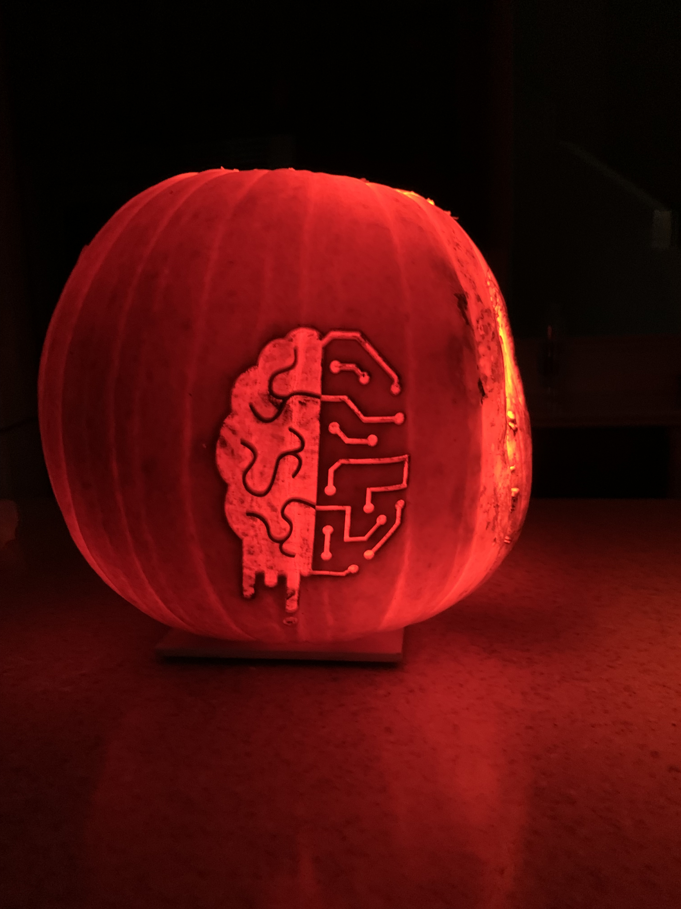
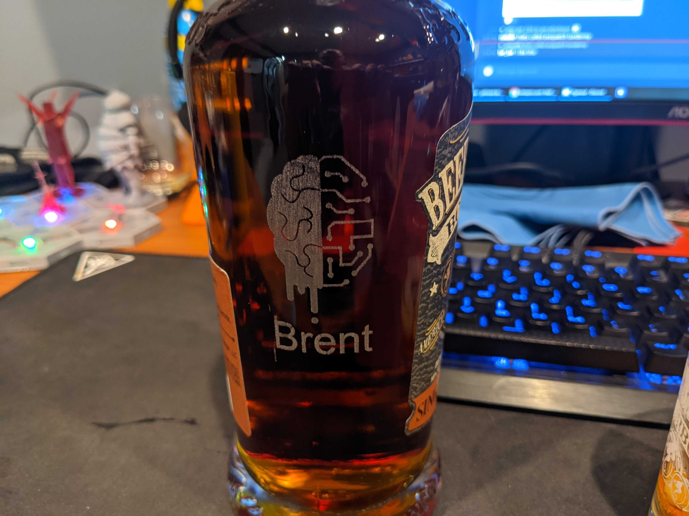

## TLP: GREEN
This document is for distribution within BrainGu, to its industry partners, and to potential job candidates.

## Contents
- [Original Logo](#Original)
- [Drop Version](#Drop)
- [Current Version](#Current)
- [Unconventional Applications](#Unconventional)
- [Credits](#credits)
- [Changelog](#changelog)

## Original

The orignal logo was created by Matt Shaver with Spence sitting beside him.  This remained the logo from 2012 until 2015.  

## Drop

In 2015, Brent reached out to an asipiring graphic designer/college student, Katie Dunn, to get some ideas on how to improve the logo from the original version.  After a few rounds of back and forth between Brent and Katie, Brent brought the potential designs to Matt and Spence for input.

After a few more rounds of back and forth, the Drop version was selected and became the new logo for BrainGu.  The final versions and discussions of the logo can be found: [Revision](https://github.com/braingu/tadpole/blob/master/documents/Logo/Braingu%20Logo%20Next%20Steps.pdf), [Dislay options](https://github.com/braingu/tadpole/blob/master/documents/Logo/Braingu%20Logo%20No%20Background.pdf), [Final](https://github.com/braingu/tadpole/blob/master/documents/Logo/Braingu%20Logo%20Final%20Rounds.pdf)

Part of the idea behind this version was to create a logo that could be used not only in the technology fields, but could also be adapated to be used in other fields by adapating the right side of the brain from the circuit board to something that matches the field. examples: healthcare, space, and education.

This logo was used in the first creation of SWAG for the company.

## Current

The current Logo is a modified version of the Drop version that was refined by [Punch](https://punchteam.com/). The core design of the logo remained, but the nerve side was updated to be more defined.

Most notibly, the biggest change was to change the drops into a drip.  This better reflected the Gu of BrainGu.

BrainGu Brand Guidelines [here](https://github.com/braingu/tadpole/blob/master/documents/Logo/BrainGu_Brand_Guidelines.pdf)

## Unconventional
The logo has been used in normal branding and swag items such as stickers, websites, business cards, and clothing.  However, there have been a few instances of employees taking the logo and making custom and unique swag items with the logo.  

### Honorable mentions
Apple Pie 

Night Light

Jack-O-Lantern 

Bourbon Bottles

## Credits
Original Design - Matt Shaver

First Revision - Katie Dunn

Second Revision - Punch

## Changelog

*  Created by Brent Johnson
*  Last modified by Brent Johnson on Jan 14, 2022
