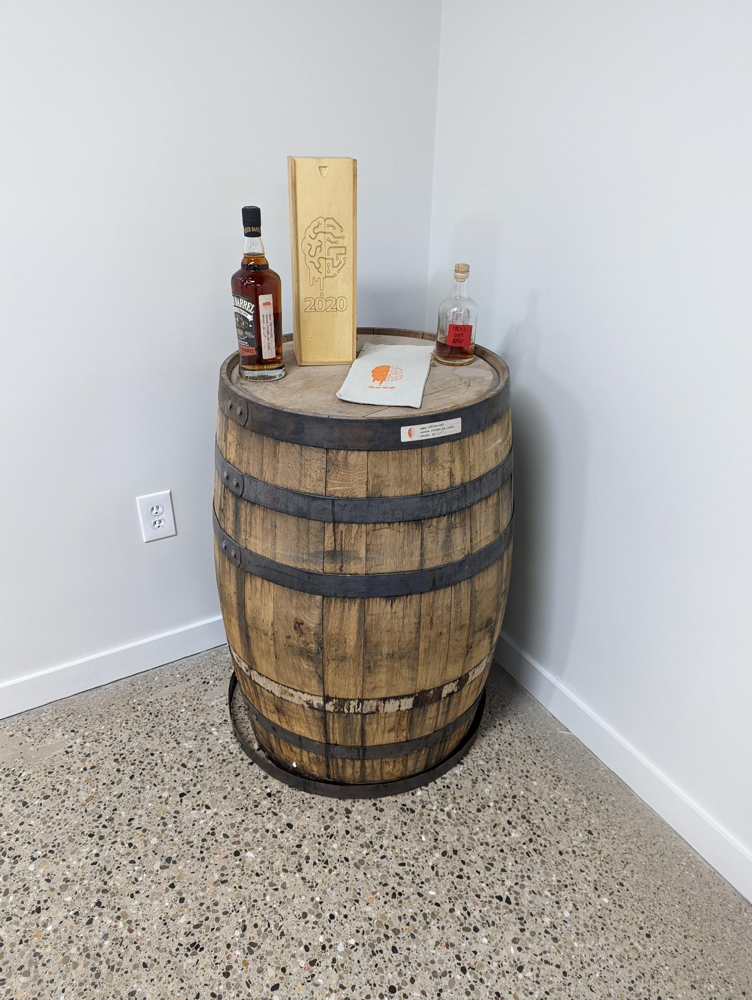

## TLP: GREEN
This document is for distribution within BrainGu, to its industry partners, and to potential job candidates.

## 2020 Bourbon
This was the first barrel of Bourbon that BrainGu purchased.  In coordination with New Holland Brewing Company, a private tasting was hosted in which Spence, Matt, Sam, and Brent were able to select which barrel and the proof to be used for bottling.  

## Pictures

## Changelog

*  Created by Brent Johnson
*  Last modified by Brent Johnson on Jan 14, 2022