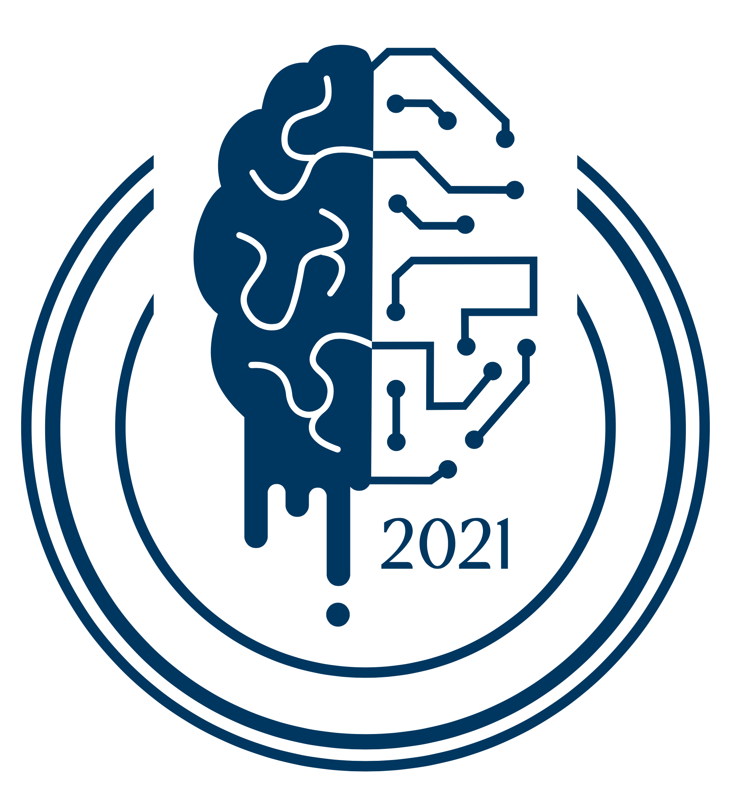
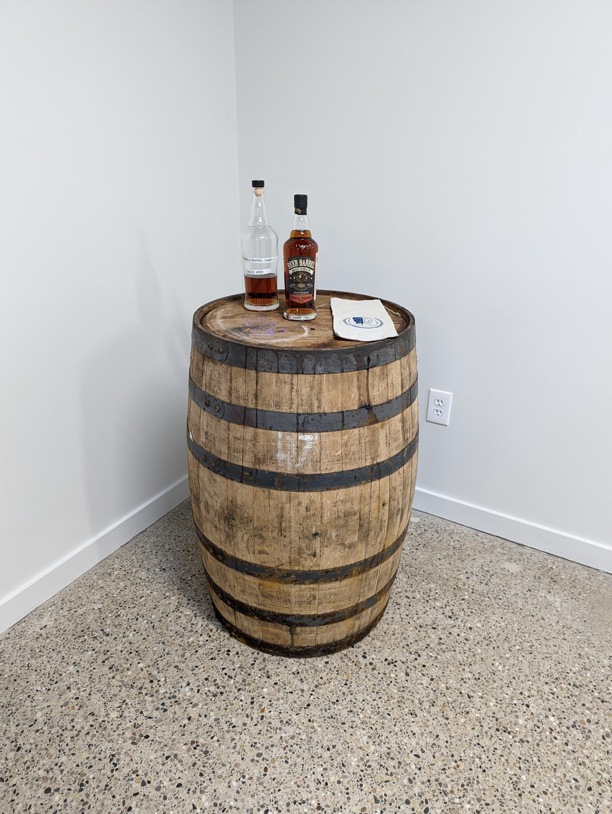
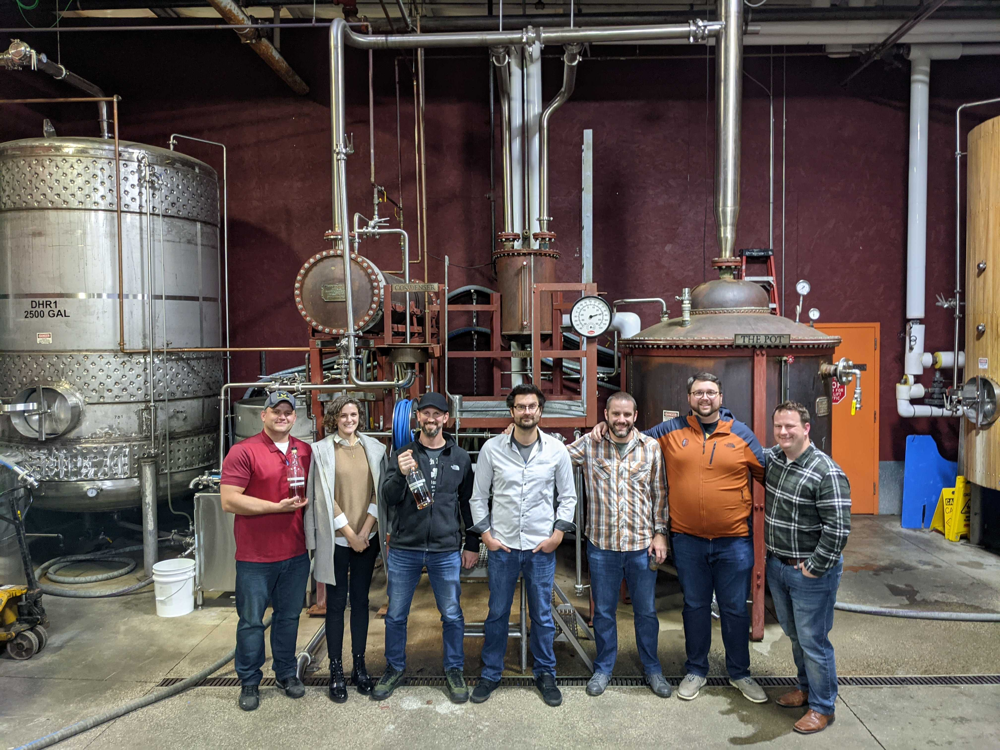

## TLP: GREEN
This document is for distribution within BrainGu, to its industry partners, and to potential job candidates.

## 2021 Bourbon
This was the first barrel of Bourbon that BrainGu purchased.  In coordination with New Holland Brewing Company, a private tasting was hosted in which Spence, Matt, Sam, Brent, Rachel O'Donnell, Tim Gast, and Aaron Marco were able to select which barrel and the proof to be used for bottling.  

## Selection
This year the founders reached out to three individuals to join in the barrel selection who have distinguished themselves as representing the BrainGu core values.

### Change the Box - Rachel O'Donnell
Rachel came into BrainGu and has demonstrated a fantastic ability to asses situations and maximize the resources available to achieve results. She builds on the knowledge of those around her to improve what is in place if possible, but is not afraid of having to start from scratch. Rachel brings a unique perspective to the BrainGu ecosystem and is able to adapt BrainGu’s boxes to improve the company and our results.

### Live with Passion - Tim Gast
Tim is a prime example of someone who fits the Live with passion value. His work is continuously on the front lines of BrainGu’s growth and it shows in the quality that he delivers. Not only is his passion apparent in his BrainGu work, he brings passion form his personal life into BrainGu as well. Finding the balance and methods to incorporate his enthusiasm for learning and technology between his work and personal life is benefit to all of those around him. 

### Focus on Community  - Aaron Marco
Aaron is an exemplary for focusing on community.  Not only by helping with the BrainBudget ADR, but by demonstrating daily a firm belief in the BrainGU strategy and approach.  He continuously reaches out and pushes others to  better themselves, both inside the shell or outside.  

## Custom Logo
To accent the bottles, a new version of the BrainGu logo was created by Lyla LaMay.

## Pictures

## Changelog

*  Created by Brent Johnson
*  Last modified by Brent Johnson on Jan 14, 2022