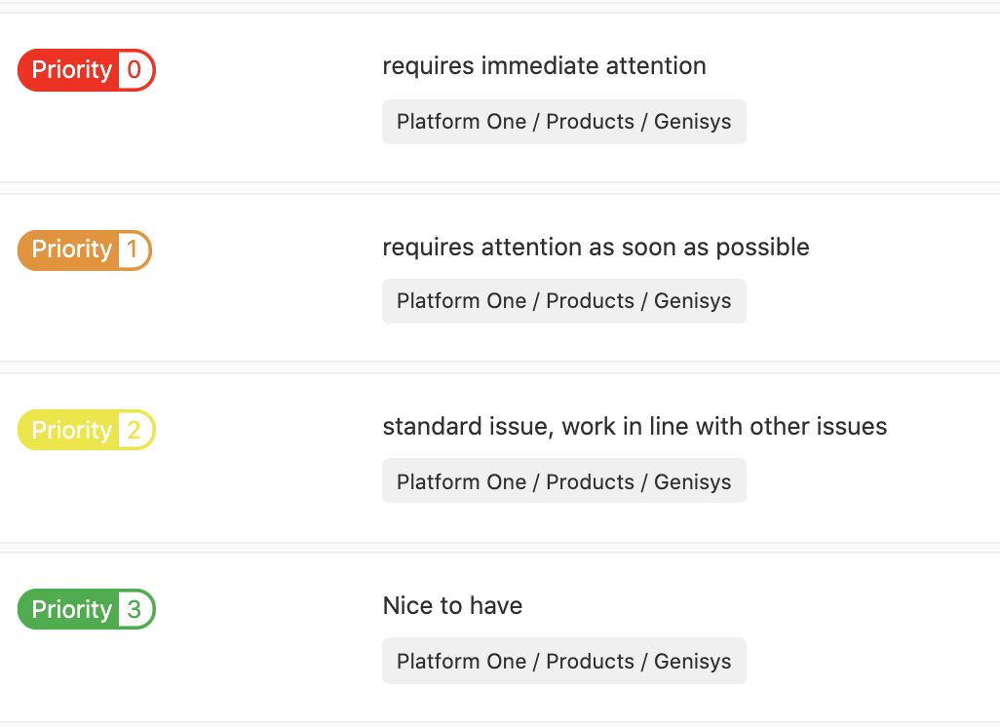

# Issue Priorities

Issues should be labeled with a priority label based on the criteria in the image below.  
Priorities should be assigned during issue creation and updated as needed.

The following list is from the LIFTT project; however, the same labels should be available across all Pegasus projects.

