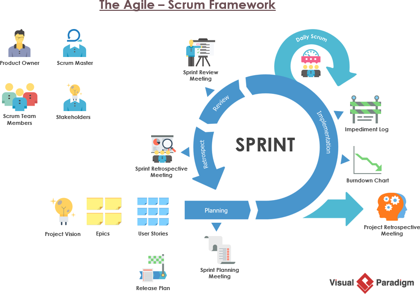

# Scrum with Team Pegasus

- [Scrum with Team Pegasus](#scrum-with-team-pegasus)
  - [This document is meant to explain:](#this-document-is-meant-to-explain)
  - [About Scrum](#about-scrum)
    - [Sprint Cadence](#sprint-cadence)
    - [The Three Pillars of Scrum](#the-three-pillars-of-scrum)
  - [Team Pegasus Sprint Process](#team-pegasus-sprint-process)
    - [Sprint Planning - Day 1 (Wednesday)](#sprint-planning---day-1-wednesday)
    - [Sprint Daily Standups - Daily](#sprint-daily-standups---daily)
    - [Backlog Grooming - Day 4 & 8 (Thursdays)](#backlog-grooming---day-4--8-thursdays)
    - [Sprint Review - Day 10 (Friday)](#sprint-review---day-10-friday)
    - [Sprint Retrospective](#sprint-retrospective)
  - [Changelog](#changelog)

## This document is meant to explain:

- What Scrum is (at a high level)
- Scrum with Team Pegasus

so that each team member has a thorough understanding of what’s expected.

## About Scrum

### Sprint Cadence

We have decided to implement a 2-week sprint cadence, which we believe to be the ideal balance between allowing the teams to focus on their work uninterrupted for a meaningful amount of time, while still remaining agile to respond to customer feedback quickly.

You can find a brief guide on Scrum and the Scrum Cycle [here](https://www.visual-paradigm.com/scrum/how-scrum-team-works/)

### The Three Pillars of Scrum

Scrum uses an empirical approach in order to adapt to the changing requirements of the customer. An empirical approach means working in a fact-based, experience-based, and evidence-based manner, and in particular, progress is based on observations of reality, not imaginary plans and ideals based on a large number of upfront requirements.

In short, we can learn and improve upon past mistakes and experiences. The three pillars of Scrum that uphold every implementation of empirical process control are:

1. **Transparency** - Scrum promotes transparency as it requires significant aspects of the process to be visible to those responsible for the outcome. These aspects are defined by a common standard so observers can share a common understanding of what is being seen.

2. **Inspection** - Timely checks on the progress toward a sprint goal to detect undesirable variances. The frequency of inspection should not be such that the inspection gets in the way of the work.

3. **Adaption** - With Agile, we always embrace and adapt to changes, so that we can constantly improve. Adaptation means that with each sprint that we execute, we change what does not work or what could work better by constantly.

## Team Pegasus Sprint Process

Our 2-week sprint cycles begin on a Monday and ends on a Friday two weeks later, which means there are 10 working days in this process.

Below is an outline of the meetings that happen over the course of a sprint cycle.

### Sprint Planning - Day 1 (Wednesday)

- Attendees: Entire team
- Purpose: Define the “what”, “why”, and “how” to produce a valuable deliverable in the upcoming Sprint.

- Outputs:

  - An updated product backlog
  - Upcoming sprint backlog
  - A Sprint Goal
  - Defined User Stories
    - Estimated story pointing

- Duration: 4 hours

### Sprint Daily Standups - Daily

- Attendees: Entire team
- Purpose: Inspect progress toward the Sprint Goal and adapt the Sprint Backlog as necessary, adjusting the upcoming planned work and making known any impediments.
- Duration: 15 min

### Backlog Grooming - Day 4 & 8 (Thursdays)

- Attendees: Team Leads
- Purpose: For the team leads and product manager to review items in the backlog and prioritize the new items as they see fit.
- Output: An updated product backlog
- Duration: 1 hour

### Sprint Review - Day 10 (Friday)

- Attendees: Entire team + stakeholders

- Purpose: For the team and stakeholders to review the work product of the Sprint and gather actionable feedback on what the Team has completed

- Structure:
  - Part 1: present demos of the work completed during the sprint and review feedback of what was done and answer questions
  - Part 2: deep dive into questions about the sprint and finalize any changes to the upcoming sprint backlog
- Output: Potential changes to the product backlog
- Duration: 2 - 2.5 hours

### Sprint Retrospective

- Attendance: Entire team
- Purpose: Time for the team to inspect the sprint and identify opportunities to improve the process
- Output: Updating the improvement backlog
- Duration: 1 - 1.5 hours

## Changelog

| Date       | Author           | Change Description                 |
| ---------- | ---------------- | ---------------------------------- |
| 09/17/2021 | Ricoh Glover     | Initial Draft                      |
| 10/15/2021 | Reginald Johnson | Document moved to doc-tadpole repo |
