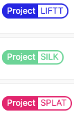
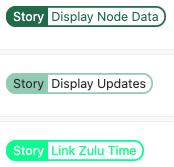
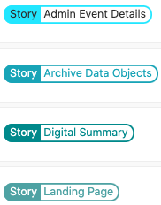
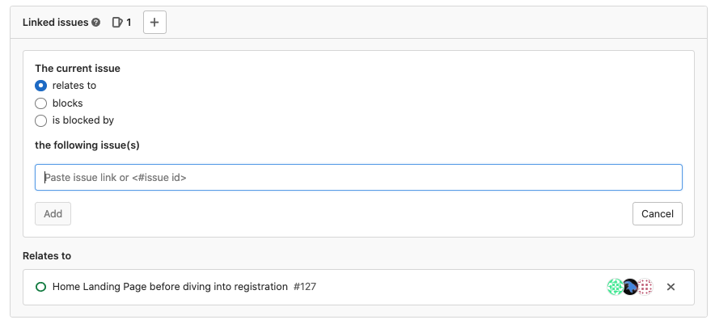
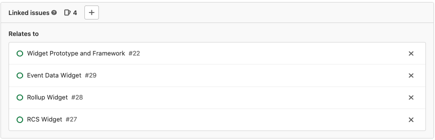

# Sprint Planning Using GitLab for Agile Development

- [Sprint Planning Using GitLab for Agile Development](#sprint-planning-using-gitlab-for-agile-development)
  - [Mapping Agile Artifacts to GitLab Features](#mapping-agile-artifacts-to-gitlab-features)
  - [A Pegasus Sprint in GitLab](#a-pegasus-sprint-in-gitlab)
    - [Sprint Planning](#sprint-planning)
  - [Issue Boards](#issue-boards)

This document describes how Team Pegasus uses Gitlab for organizing Agile development. This document borrows from and modifies GitLab's own [How to use GitLab for Agile software development](https://about.gitlab.com/blog/2018/03/05/gitlab-for-agile-software-development/)

## Mapping Agile Artifacts to GitLab Features

| Agile Artifact        | GitLab Feature                    |
| --------------------- | --------------------------------- |
| User Story            | Issues                            |
| Task                  | Issue                             |
| Points and Estimation | Weights                           |
| Product Backlog       | Issue List and Prioritized Labels |
| Sprint                | Iteration                         |

## A Pegasus Sprint in GitLab

### Sprint Planning

**Creating User Stories**

Prior to sprint planning, create User Stories as GitLab Issues.

- Each story should be given a title that starts with "Story:" such as "Story: Display Node Connection Data".
- The description of the story should start with the standard User Story blurb; "As a user/developer/etc. I would like ... in order to ..."
- Add the following initial labels. These labels should already exist, and should not need to be created.

| Label             | Example(s)                                                | Purpose                                                     |
| ----------------- | --------------------------------------------------------- | ----------------------------------------------------------- |
| The "Story" label |             | Populates the "Story" Issue board                           |
| Project Name      |    | Adds the story to correct column on the "Story" issue board |
| Refinement Needed |  | Story has outstanding questions                             |

- Additionally, you may need to create a story label if one does not already exist. The label should have the same name as the title of the story you are writing. This story label will be attached to the "Tasks" we will create later from the Tasks that are entered in the story's description during sprint planning.

| Label      | Examples                                               | Purpose                                     |
| ---------- | ------------------------------------------------------ | ------------------------------------------- |
| Story Name |  | Visual and issue board link to Task issues" |

These labels will help ensure the story is displayed on the correct issue board.

**Sprint Planning**

During sprint planning, team members add a breakdown of tasks required to complete the story to the story's description. Each of these tasks will be turned into a GitLab issue later.

Additionally, team members record any questions they have in the story's description. If no questions exist, then the "Refinement Needed" label can be removed.

Finally, estimated story points are entered as a "Weight" for each story.

**Creating Tasks**

After sprint planning is complete a GitLab issue is created for each task. New issues should have the following labels added.
| Label | Example(s) | Purpose|
| ----------------- | --------------------------------------------------------- |--|
| The "Status: Backlog" label|| Adds the issue to the backlog |
| Project Name |  | Enables filtering by product name |
| Applicable Story name |  | Enables filter by story|

Additionally, add a priority label based on the documentation [here](./issue-priorities.md)

**Connecting Tasks to Stories**

Finally, connect the task issue to the story issue by opening the "Linked Issues" section of a task or story issue and entering the issue number of the linked story or task.

This linkage simplifies tracking story completion.

## Issue Boards

- [Current Sprint](https://code.il2.dso.mil/groups/platform-one/products/genisys/-/boards/871?iteration_id=Current&)
- [Product Backlog](https://code.il2.dso.mil/groups/platform-one/products/genisys/-/boards/870)
- [Stories](https://code.il2.dso.mil/groups/platform-one/products/genisys/-/boards/886)
