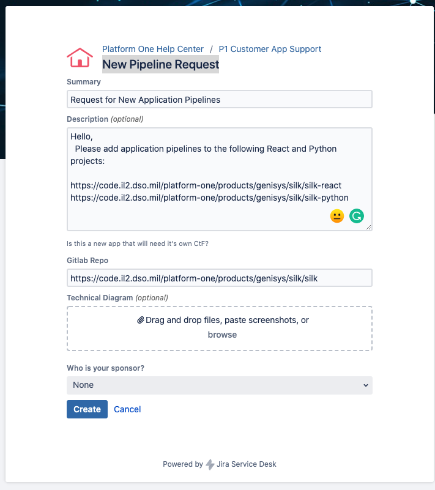

# How To Scaffold a New Project

- [How To Scaffold a New Project](#how-to-scaffold-a-new-project)
  - [Steps](#steps)

Document the steps in setting up a project for team development. At the end of this process we'll have create the necessary repositories with initial project code, initial sprint tickets, and submitted P1 tickets to create the pipeline.

## Steps

1. Create Repositories

   - Contact Matt to create the repositories if they do not already exist. If Matt is unavailable, contact Ricoh.

1. Create Initial Issues

   - R&D Tickets
     - Models
     - Novel UI/UX requirements
     - Novel front end or backend requirements

1. Commit Initial Code project repositories

   - **React**:

     1. Clone the [mission-react](https://github.com/braingu/mission-react), follow the instructions in the README.md file, and push to the React project repository.
     1. Update the project's README.md file

   - **Python**:
     1. Clone the [mission-python](https://github.com/braingu/mission-python), follow the instructions in the README.md file, and push to the Python project repository.
     1. Update the project's README.md file

1. Create Pipelines

   Submit a ["New Pipeline Request"](https://jira.il2.dso.mil/servicedesk/customer/portal/73/create/454) ticket to P1 to create the React and Python pipelines.

    

   You can paste the following text as the description of the ticket.

   ```
   Hello,
   Please add application pipelines to the following React and Python projects:

   https://code.il2.dso.mil/platform-one/products/genisys/[PROJECT NAME]/[PROJECT NAME]-react
   https://code.il2.dso.mil/platform-one/products/genisys/[PROJECT NAME]/[PROJECT NAME]-python
   ```

   The "Gitlab Repo" should be the overall project name:

   ```
   https://code.il2.dso.mil/platform-one/products/genisys/[PROJECT NAME]
   ```

   Get project sponsor information from Team Lead. Select the sponsor from the "Who is your sponsor?" list if they are present there. Otherwise, select other and type the sponsor's name in the description.

1. Contact Matt to set up the new repository to send an alert to the #darkmode-rouge20-dev Slack channel when the pipeline fails.
