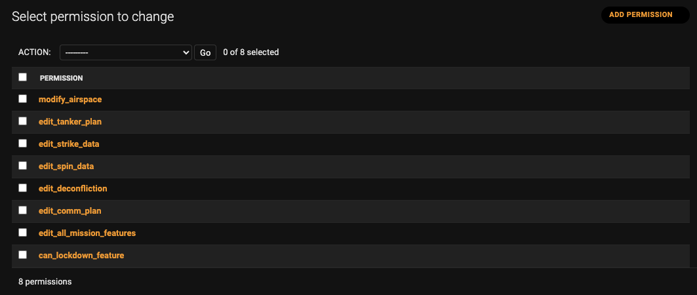

# WIDOW Role Based Access Control (RBAC)

Background

WIDOW Role Based Access Control (RBAC) restricts the ability of WIDOW users to 
perform certain actions based on their Mission, and Event role membership. 
Previously, access permissions were managed globally, where a user can be 
a WIDOW super user group member that has access to all Missions, regardless 
of their the mission membership.

## RBAC Requirements

### Mission & Event Role Management

An Event has a "**_Leadership_**" Role, which will give any member
assigned to that role, the ability to create, duplicate, archive, and edit
missions under that event.

Each event will have multiple function roles, and various Leadership
roles. A mission leadership role member can have all access for updating
a mission. Each function role will have different permissions depending
on the role.

| **Role Type / Group**        | **Description**                                                                                                        |
| ---------------------------- | ---------------------------------------------------------------------------------------------------------------------- |
| All Users                    | All WIDOW users.                                                                                                       |
| WIDOW Super User             | WIDOW super user group members.                                                                                        |
| Event Leadership role member | Event Leaders have all write permission to all event’s missions, including creation, duplication, archive missions.    |
| Mission User Member          | All Mission Members regardless of roles.                                                                               |
| Mission Leadership roles     | Mission leadership roles (MC, MPCC, IOR, VUL) have all write permissions to missions, and lock / unlock missions.      |
| Mission Functional roles     | Mission functional roles (Strike, C2, SPINS, escort, AAR) have specific permissions depending on the functional role.  |

For more detailed information of each mission and event roles
permission:

<https://docs.google.com/spreadsheets/d/1JGWaMxT_ws3PTUJz8nvHGzlVS5Tpxg6CNPlTFhlE4CQ/edit#gid=0>

#### Ability to assign user to mission’s role


#### Front end Disabling / Hiding Edit button based on Permissions

Based on the user’s authorization token, and the current active mission / event they are navigating to, the UI should hide or disable the Edit / Save functionality in the page.

#### Back end rejecting / granting API request for Updating data.

Based on the user’s authorization token, and the current object being updated, it needs to return a 403 status code if it fails the permission check.

## Backend Architecture

### Backend Implementation

The backend implementation for RBAC involves of modifying legacy code where it was previously using the Widow Super User group membership as a way to allow _POST/PUT/PATCH/DELETE_ API access. The legacy code implementation had used the built-in _DjangoModelPermissions_ which requires explicit model add/change/delete/view permission to be added for each model objects.


As part of the initial backend RBAC implementation, we removed this from the DefaultView, and added a custom Permission class for determining the permission based on the Event or Mission role membership.

## Role Permission Data Model

A separate Permission table was created to store all the WIDOW front end feature functionality that should be enabled / disabled based on the Mission / Event role assignments.



A Mission Role table for storing all available roles. If we needed a new role in the future, we can add it in here. Note that any role addition / update should be done in the fixture file so that it will be deployed appropriately to staging / production environment.


Each roles will have specific default permission policy associated to it. This should map directly with the Role Permission Matrix spreadsheet.


The Mission Permission Policy defines the permission for Mission level roles.

The Event Permission Policy defines the permission for Event level roles.

Currently both event and mission can share the same roles. The implementation for the Event leadership is currently reusing the ‘MC’ role in the data model.

Note that any permission changes should be done in the fixture file so that it will be deployed appropriately to staging / production environment.

Mission Role Membership stores the role and user mapping for the mission.


Event Role Membership stores the role and user mapping for the event.


### Custom Permission Classes for Django REST Framework

Using the DRF permission classes framework:
<https://www.django-rest-framework.org/api-guide/permissions/#custom-permissions>
there are 3 new custom Permission classes that can be used on the
ViewSets for enabling RBAC restrictions on certain HTTP methods.

<table>
<tbody>
<tr class="odd">
<td>WidowSuperUserPermission</td>
<td>Only verify the current user’s group membership of the WidowSuperUser group. If a user belongs to the group, it will grant the permission.</td>
</tr>
<tr class="even">
<td>WidowMissionRolePermission</td>
<td><p>When this is defined in the Viewset, it will do the following:</p>
<ul>
<li><p>Finds the mission ID associated to the object being updated/ inserted by the API. For example, if the asset is being updated, it needs to get the parent mission for that asset.</p></li>
<li><p>Query the role membership based on the mission ID.</p></li>
<li><p>Query the permissions based on the role membership.</p></li>
<li><p>If the permission contains the edit_all_mission_features then it will just grant the permission right away.</p></li>
<li><p>Determine if the object and field being updated has a valid permissions. This is currently a hardcoded configuration in permissions.py FIELD_PERMISSION_CONFIG</p></li>
</ul></td>
</tr>
<tr class="odd">
<td>WidowExerciseUserPermission</td>
<td><p>When this is defined in the Viewset, it will do the following:</p>
<ul>
<li><p>Finds the event ID associated to the object being updated/ inserted by the API.</p></li>
<li><p>Query the role membership based on the event ID.</p></li>
<li><p>Query the permissions based on the role membership.</p></li>
<li><p>Determine if the object and field being updated has a valid permissions. This is currently a hardcoded configuration in permissions.py FIELD_PERMISSION_CONFIG</p></li>
</ul></td>
</tr>
</tbody>
</table>

Example on how a permission class is applied to a ViewSet.

```python
class AirspaceViewSet(ManyModelViewSet):

permission_classes = (partial(WidowExerciseUserPermission, \["POST",
"PUT", "DELETE", "PATCH"\]),)

queryset = Airspace.objects.all().prefetch_related("locations")

serializer_class = AirspaceSerializer

class CommPlanVersionViewSet(DefaultView):

permission_classes = (partial(WidowMissionRolePermission, \["POST",
"PUT", "DELETE", "PATCH"\]),)

queryset = CommPlanVersion.objects.all()

serializer_class = CommPlanVersionSerializer

class CommPlanElementViewSet(ManyModelViewSet):

permission_classes = (partial(WidowMissionRolePermission, \["POST",
"PUT", "DELETE", "PATCH"\]),)

queryset = CommPlanElement.objects.all().prefetch_related("version")

serializer_class = CommPlanElementSerializer
```

### Backend Testing Guide

When testing RBAC related APIs in the unit tests, you need to test by logging in as different users with different roles for testing API restrictions and return status code. For examples, you can look at test_rbac.py and see how you can use apply_jwt_token_to_client to login as different users before calling the REST API.

```python
class EventLeaderTest(APITestCase, ApiHelperMixin):

fixtures = \["prod_fixture", "tests/test_rbac/user_fixture",
"tests/test_rbac/event_fixture"\]

def setUp(self):

settings.ENABLE_SERVERSIDE_RBAC = True

self.apply_jwt_token_to_client(username="eventleader")

self.event = Event.objects.first()

def
test_create_mission_for_event_leader_should_be_allowed(self):

resp = self.create_mission("NEW EVENT MISSION 1", self.event.id)

self.assertEqual(resp.status_code, 201)

def
test_create_mission_for_non_event_leader_should_not_be_allowed(self):

self.apply_jwt_token_to_client(username="nonsuperuser")

resp = self.create_mission("NEW EVENT MISSION 1", self.event.id)

self.assertEqual(resp.status_code, 403)

def test_create_mission_for_superuser_should_be_allowed(self):

self.apply_jwt_token_to_client(username="superuser")

resp = self.create_mission("NEW EVENT MISSION 1", self.event.id)

self.assertEqual(resp.status_code, 201)

def
test_create_mission_with_no_event_should_not_be_allowed(self):

self.apply_jwt_token_to_client(username="nonsuperuser")

resp = self.create_mission("NEW EVENT MISSION 1", None)

self.assertEqual(resp.status_code, 403)
```

## Front End Implementation Guide

There are 3 API calls for retrieving permissions that is used by the
front end to query all the granted permissions for the current
authenticated users.

|                                                             |                                                                                                                                                                                                                                      |
| ----------------------------------------------------------- | ------------------------------------------------------------------------------------------------------------------------------------------------------------------------------------------------------------------------------------ |
| GET /mpc/missions/&lt;uuid:mission_id&gt;/my_permissions/   | retrieve the permissions based in the mission id.                                                                                                                                                                                    |
| GET /mpc/events/&lt;uuid:event_id&gt;/my_permissions/       | retrieve the permission based on the event id.                                                                                                                                                                                       |
| GET /mpc/exercises/&lt;uuid:exercise_id&gt;/my_permissions/ | retrieve the permission based on the exercise id. Currently we do not have any exercise level permission, so the implementation for this is just to query all child events for the exercise and returns a unique set of permissions. |

For the Mission permissions, the API query is currently being called
from the sidebarMenu.tsx after it loads the mission data. The permission
is then stored in Redux. There are 2 components that can be used for
showing / hiding buttons depending on the available permission.

A WidowAccessControl component is useful to only show the children if
the permissionKey passed in exist in the Redux permission container.

```javascript
<WidowAccessControl permissionKey={PermissionKey.CAN_LOCKDOWN}>;

<button
    id="lock-btn"
    type="button"
    className={this.props.mission.locked ? 'locked' : ''}
    onClick={() =>; this.lockMission()}
    disabled={!this.props.isLeadershipRole && !this.props.userIsSuper}
>
    Lock Mission
</button>;

</WidowAccessControl>;
```

For Functional based component, you can also use the usePermission hook, which then gives you a boolean value wether the permission is granted or not.

```javascript
const allowEdit: boolean = usePermission({
  permissionKey: PermissionKey.EDIT_TANKER_PLAN,
});
```

You can then easily use the value to enable / disable or hiding /
showing the button.

```javascript
{!is_readonly && allowEdit && (
    <AddNewElementButton
        isFullWidth
        padding="padded"
        label="Plan"
        onClick={handleTankerPlanCreate}
        testId="new-plan-button"
    />;
)}

OR

<button
    id="edit-btn"
    type="button"
    onClick={() =>; this.save()}
    disabled={!allowEdit}
>;
```

## Testing RBAC in React Frontend

The easiest approach for testing a mission level component with RBAC restriction is to disable the RBAC setting for the test. This will allow the test to render all of the child component and ignore any RBAC restriction.

### Mocking the ENABLE_ROLE_BASED_ACCESS to False

If you are using the usePermission hooks or WidowAccessControl component, you can apply the following jest mock to disable it and make sure that the child components will be rendered or enabled.

```javascript
jest.mock("../../../settings", () => ({
  ENABLE_ROLE_BASED_ACCESS: false,
}));
```

### Test your RBAC implementation in a separate test file.

Due to the limitation of not being able to switch the mock on and off within the same test file, you can create a separate test rbac file for your component, or add it to the existing allintegration.rbac.test.tsx file where you can assert that the buttons are not being rendered when the ENABLE_ROLE_BASED_ACCESS is true

```javascript
describe('Strike User Role RBAC Scenarios', () => {
    it('Strike Route Modal save button should not be displayed without
        permission', async () => {
        connectedRender(&lt;MissionAssetsView />)
        userEvent.click(screen.getByText('Strike RTE (COORDS)'))
        // click the strike route opener and expect save button to be hidden
        expect(screen.queryByText('Save')).not.toBeInTheDocument()
        expect(screen.queryByText('Save + Close')).not.toBeInTheDocument()
})
```

### Mocking the API calls directly

When calling the API directly from the component to retrieve the permission and storing it in the component local state, you can just mock the apiService call directly to return the permission you needed for testing.

```javascript
jest.mock('../../../global/apiService', () => ({

loadExercisePermissions: jest.fn((id: Id) => new Promise((resolve) => resolve(\[\])))
}))
```

This approach is currently needed for the event level permission, since it is not using the WidowAccessControl or usePermission hook.
