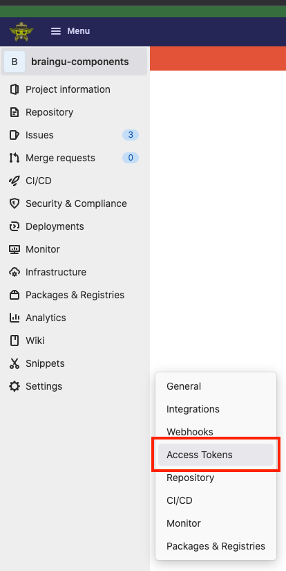
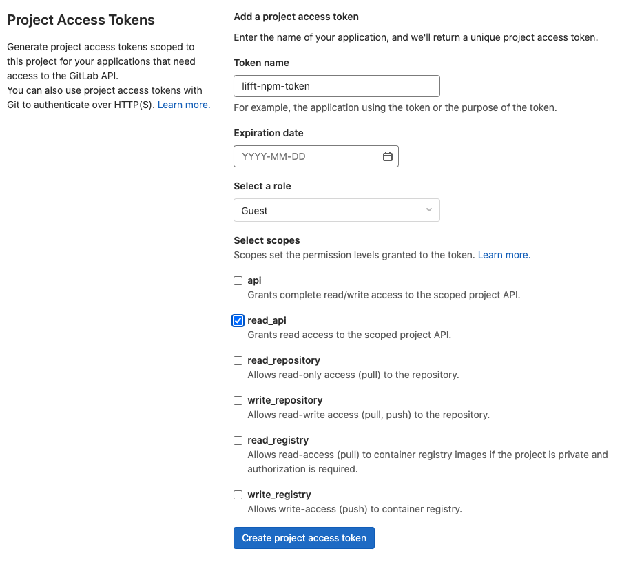
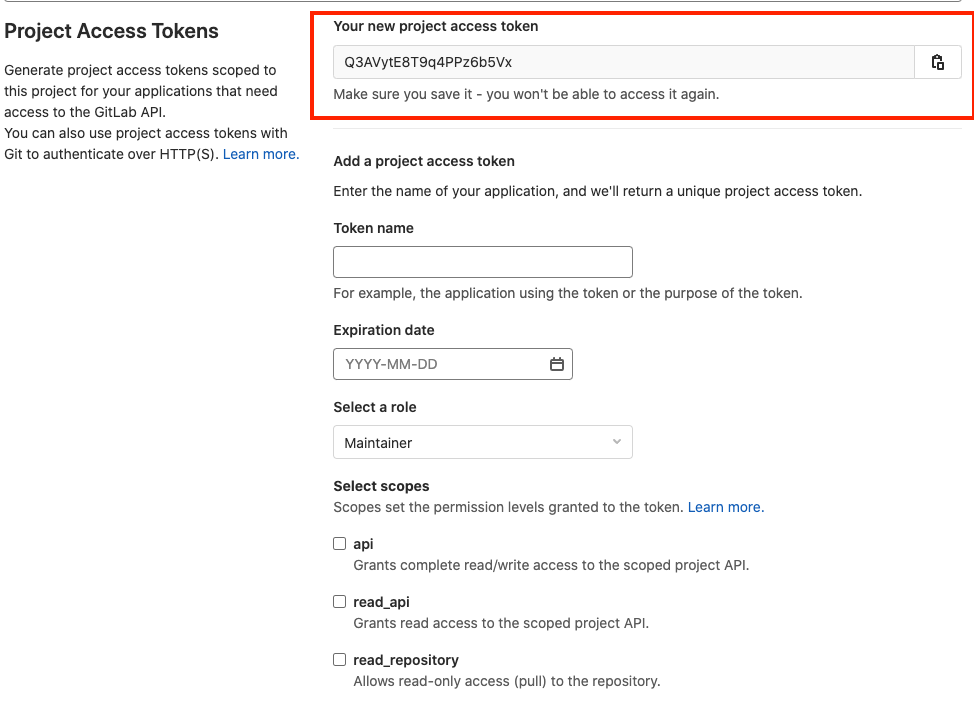
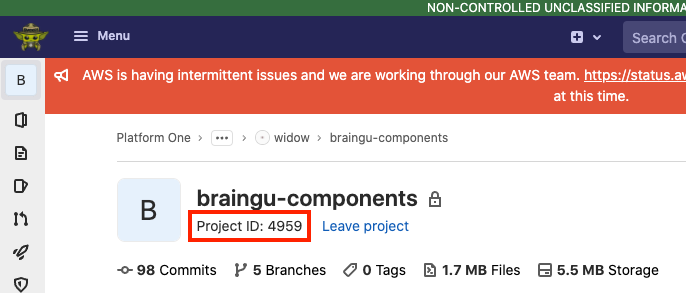

# How to Install a Package From the P1 GitLab Repository 📦

- [How to Install a Package From the P1 GitLab Repository 📦](#how-to-install-a-package-from-the-p1-gitlab-repository-)
  - [Purpose 🧠](#purpose-)
  - [Method 1 - Installing the Package from the P1 Repo 🗄️ ](#️-method-1---installing-the-package-from-the-p1-repo-️-️)
    - [Create an Access Token for the Package](#create-an-access-token-for-the-package)
    - [Add the Access Token to the Project](#add-the-access-token-to-the-project)
    - [Create a Project Specific .npmrc file](#create-a-project-specific-npmrc-file)
    - [Package Installation](#package-installation)
  - [Method 2 - Using a Tarball File ⚫](#method-2---using-a-tarball-file-)
    - [NOTES](#notes)

## Purpose 🧠

Document techniques to use package from a P1 Gitlab project. These packages were created using a P1 package pipeline. Refer to the article ["Create A Package From A Repo"](Create_A_Package_From_A_Repo.md) for mor information on creating a package.

## Method 1 - Installing the Package from the P1 Repo 🗄️

NOTE: This method was tested and confirmed working while troubleshooting the `mission-react-maps` installation in the `widow-react` repository.

### Create an Access Token for the Package

To use the install the package via NPM, we will need to provide NPM access to the Gitlab repository. The first step in making that possible is to create an access token that can be used to access the repo.

1. Go to the package's Gitlab page and used the menu on the right of the screen to navigate to the package's Access Token page.



2. Create a token by entering a name and setting an expiration date. Additionally, set the role to 'guest' and api access to read registry.



3. Click the "Create Project Access Token" to create the token.



4. Finally, copy the token so that it can be used in the project installing the package.

### Add the Access Token to the Project

Create a `.env` file in the calling project and add that file to the project's `.gitignore`

```
// variable name=[token you created in the previous section]
GUCIFER_TOKEN="XXXXXXXXXXXXXXXXX"
```

Additionally, this token will need to be added to the tokens used by the pipeline when building the project. ( TBD on how to do this, but it should be possible by submitting a P1 ticket)

### Create a Project Specific .npmrc file

If it does not already exist, create a new `.npmrc` file in the project's root directory and add the following.

```
@[PROJECT_NAME]:registry=https://code.il2.dso.mil/api/v4/projects/[PROJECT_ID]/packages/npm/
//code.il2.dso.mil/api/v4/projects/[PROJECT_ID]/packages/npm/:_authToken=$[TOKEN_NAME_FROM_ENV_FILE_CREATED_IN_PREVIOUS_STEP]
```

For example, the following string would be used to import a package named Gucifer that is part of the widow-components Gitlab project (https://code.il2.dso.mil/platform-one/products/widow/widow-components) NOTE: this project had its name changed to "braingu-components" after creation.

```
@widow-components:registry=https://code.il2.dso.mil/api/v4/projects/4959/packages/npm/
//code.il2.dso.mil/api/v4/projects/4959/packages/npm/:_authToken=$GUCIFER_TOKEN
```

The project ID is available on the project's home page.



### Package Installation

Run `npm install [PACKAGE_NAME]` to install the new package

## Method 2 - Using a Tarball File ⚫

NOTE: This method works, and is in use in the [LIFTT project](https://code.il2.dso.mil/platform-one/products/genisys/liftt/liftt-react)

The P1 Package pipeline creates a `.tgz` file that can be used to install a package.

1. Go the the package's "Package Registry" Gitlab page using the menu on the left side of the page. The example in this article if from the [widow-components](https://code.il2.dso.mil/platform-one/products/widow/widow-components) project.

   

2. Select the package you want to download.

   

3. Click on the package's `.tgz` at the bottom of the page to download it to your project. Keep in mind that this file will only exist if the package's build pipeline has completed successfully.

   

4. Install the package in your project by running `npm install file:@[FILE_NAME] --save`; for example:

`npm install file:@widow-components_gucifer-0.0.1.tgz --save`

After the installation is complete, the new package should be listed in the project's `package.json` file:


At this point, you can use the package in your application. For example, the `@widow-components/gucifer` package would be available for use like this:

```js
import { ReactComponentExample } from "@widow-components/gucifer";

function App() {
  return (
    <div className="App">
      <ReactComponentExample />
    </div>
  );
}

export default App;
```

### NOTES

- If the package you are using was built using the steps in ["Create A Package From A Repo"](Create_A_Package_From_A_Repo.md) then you can view the makes available for use by looking in the package's `index.d.ts` file.


- At this point, the tarball file must stay with the package as long the component path in `package.json` points to the tarball.
